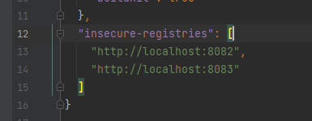

# Configurações do Nexus
- MAVEN: https://blog.sonatype.com/using-nexus-3-as-your-repository-part-1-maven-artifacts
- NPM: https://blog.sonatype.com/using-nexus-3-as-your-repository-part-2-npm-packages
- Docker: https://blog.sonatype.com/using-nexus-3-as-your-repository-part-3-docker-images

Informações do NPM:
- https://gist.github.com/shirakaba/d4bc52330aecc2fcb20d15a29b2927e1
- https://levelup.gitconnected.com/deploying-private-npm-packages-to-nexus-a16722cc8166
  Comando para gerar o usuário e senha do registry do NPM: echo -n 'admin:admin' | openssl base64
  Senha (admin:admin): YWRtaW46YWRtaW4=
  Documentação nexus NPM: https://help.sonatype.com/repomanager2/node-packaged-modules-and-npm-registries

Informações do Docker:
- Necessário expor as portas que foram configuradas dentro do repositório do mesmo.
- Necessário informar registros inseguros caso seja necessário funcionar sem SSL, é preciso também informar dentro do arquivo ```daemon.json``` que ficar localizado no windows dentro de ```/usuario/.docker/daemon.json``` ou no linux em ```/etc/docker.daemon.json```algo similar a isso:

  
- Necessário autenticar com o comando ``docker login -u admin -p admin123 https|http://dominio:porta``
- Sempre que for dar um pull ou push é necessário informar o registro do repository, por exemplo:
  - docker pull localhost:8082/mariadb:latest

Subir uma nova imagem:
  - docker build -t username/name-repository .
  - docker tag username/name-repository:latest localhost:8083/username/name-repository:latest
  - docker push localhost:8083/username/name-repository:latest


Nexus:
- Na versão gratuita não é possivel fazer publish em groups.

Bug com o comando 'npm publish': https://github.com/npm/cli/issues/2453
